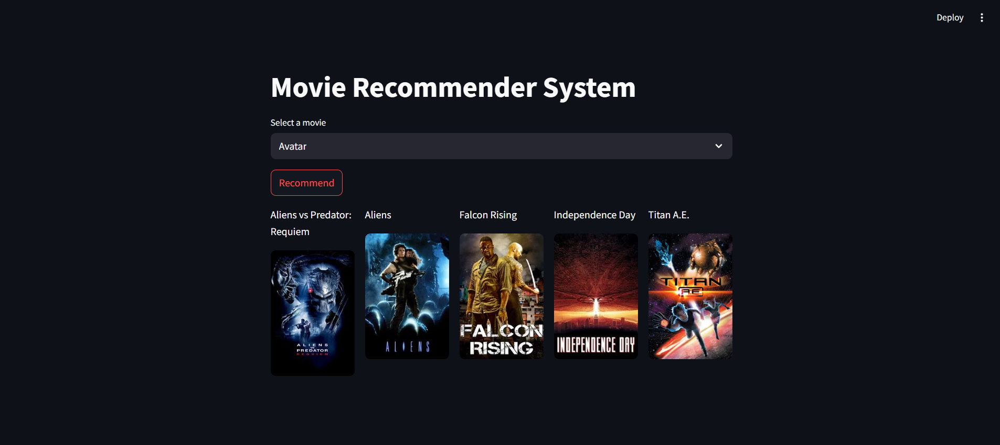
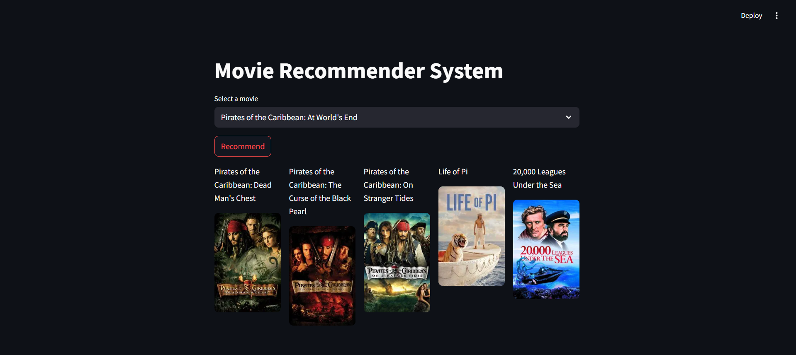

#  Movie Recommender System

A Machine Learning-based Movie Recommender System that suggests the **top 5 similar movies** based on user input using **content-based filtering**.

---

##  Features

-  Recommends top 5 similar movies
-  Uses content-based filtering (cosine similarity)
-  Fetches movie posters using TMDB API
-  Interactive UI built with Streamlit
-  Fast and user-friendly interface

---

##  Live Demo

Click here to try the app   
 [Movie Recommender App](https://movie-recommendation-system-uf2tlcpuxebpusrztkxclp.streamlit.app/)
##  Preview

### Sample 1

### Sample 2

##  Tech Stack

- Python
- Pandas, NumPy
- Scikit-learn
- Streamlit
- TMDB API

---

##  How It Works

The system recommends movies based on similarity scores calculated using:

- Genres  
- Keywords  
- Cast  
- Crew  

These features are combined and processed using cosine similarity to find the most relevant movies.
